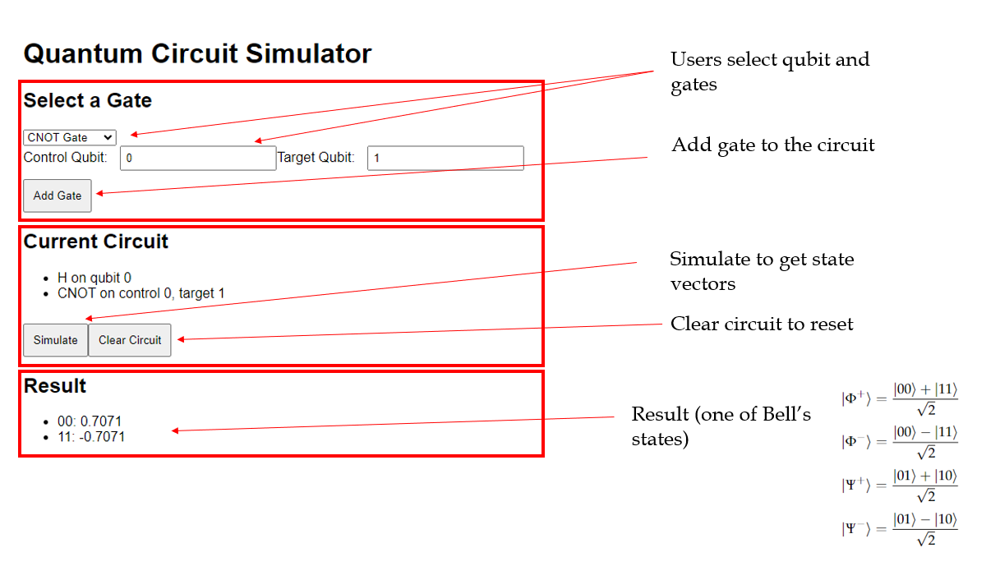

# A Simple Quantum Circuit Simulator 

## Overview ⚙️
This project allows users to select the number of qubits (max is 5) and apply Gate operations on them mimicking a quantum circuit. 

For example, users can select qubit 0 and the Hadamard gate, add them to the circuit, and run a simulation to get the state vector of the selected qubit. If users wish to use the CNOT gate, they have to specify which qubits are the control and the target qubits, respectively, in a 2-qubit system. 

Aside from the Hadamard and the CNOT gates, there are Pauli-X, Y, and Z gates for the users to play with.

This project was built using React.js for the frontend and FastAPI for the backend. As a beginner in building full-stack applications, this project was built for me to learn and get experience in building full-stack applications while implementing concepts in physics wherever possible.

## Features 🧐
- Select the number of qubits.
- Choose from various quantum gates (Hadamard, CNOT, Pauli-X, Y, Z).
- Add gates to the quantum circuit.
- Display quantum states after simulation.

# To get started

## Prerequisities ✅
- Python 3.6 or higher must be installed 
- Node.js and npm must be installed 

Please refer to the references section for the installation guide.

## Backend Setup 🛠️
1. Clone the repository: 
         `git clone https://github.com/Sharen-Rajenthiran/quantum-simulator.git`
2. Change the directory to the repository directory:
           `cd quantum-simulator` 
3. Navigate to the backend folder if you haven't in step 2: `cd quantum-simulator`
4. Create a virtual environment (optional but recommended): `python -m venv your_environment_name`
5. Activate your virtual environment if you have completed step 4: `your_environment_name\Scripts\activate`
6. Install the required packages:
`pip install -r requirements.txt`
7. Run the FastAPI server: `uvicorn smain:app --reload`

## Frontend Setup 🖥
1. Navigate to the frontend folder: 
         `cd quantum-frontend`
2. Install the dependencies using npm:
           `npm install` 
3. Run the frontend server (in a new terminal) while the backend server is running:
`npm start`

Alternatively for step 1 in backend setup, you can download the repository. To terminate the backend and frontend servers, use `ctrl + c` on your keyboard for windows. 

# Known Issues and Future Improvements

## Backend Issues 🚧
1. The simulation results may not reflect the expected output, especially for multi-qubit operations. The circuit construction logic may need further refinement to ensure correct gate application and state retrieval. 
2. The original idea was to use `Qiskit` backend services to get the state vectors and also simulate the quantum circuit but the approach was not complete due to time constraints. 
3. In the main directory, there are `main.py` and `smain.py` python files. The `main.py` file was intended to implement the original idea using `Qiskit` backend services. The `smain.py` file is a simpler version of `main.py`. When running the backend server, please make sure in the `uvicorn smain:app --reload` command, `smain` is used.
4. The backend currently returns state vectors, but proper handling and response formatting for different gates and qubits need to be implemented.

## Frontend Issues 🌐
1. The user interface may not be fully intuitive for beginners. Improvements in the design and interactivity (such as drag-and-drop functionality) are desired. 
2. The UI design is lacking.  

## Future Improvements ✍🏻
1. Implement a clearer user interface with drag-and-drop functionality for gate selection. 
2. Enhance error handling in the backend to provide more informative messages to the user.
3. Add unit tests for both the frontend and backend components. 
4. Allow users to save and load circuits. 
5. Make proper use of backend services. 
6. Implement deployment and maintenance phases.

# References 📚
1. For python installation: https://www.python.org/downloads/ 
2. For node.js installation: https://nodejs.org/en
3. For qiskit documentation: https://docs.quantum.ibm.com/ 
4. For qiskit simulation documentation: https://qiskit.github.io/qiskit-aer/ 

## Thank You! 😄

